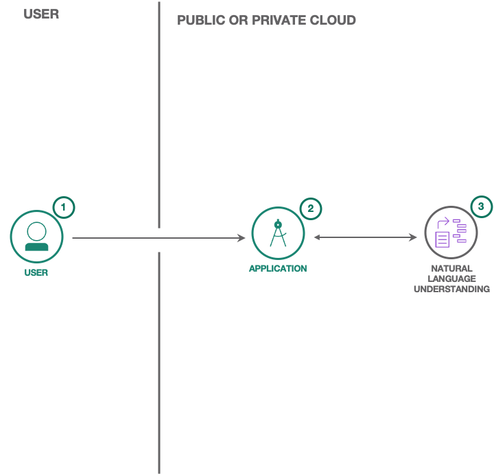

<h1 align="center" style="border-bottom: none;">🔎 Natural Language Understanding Code Pattern </h1>
<h3 align="center">Natural Language Understanding is a collection of APIs that offer text analysis through natural language processing. This set of APIs can analyze text to help you understand its concepts, entities, keywords, sentiment, and more. Additionally, you can create a custom model for some APIs to get specific results that are tailored to your domain.</h3>
<p align="center">
  <a href="https://github.com/IBM/natural-language-understanding-code-pattern/actions/workflows/nodejs.yml/">
    
  </a>
  <a href="#badge">
    
  </a>
</p>
</p>

Demo: https://natural-language-understanding-code-pattern.ng.bluemix.net/

### Flow

<p align="center">
  
</p>

1. User sends messages to the application (running locally, in the IBM Cloud or in IBM Cloud Pak for Data).
1. The application sends the user message to IBM Watson Natural Language Understanding service.
1. Watson Natural Language Understanding processes the text or url and extract features such us keywords, concepts, categories. The service can be provisioned on either IBM Cloud or IBM Cloud Pak for Data.

## Prerequisites

### Public Cloud

1. Sign up for an [IBM Cloud account](https://console.bluemix.net/registration/).
1. Download the [IBM Cloud CLI](https://console.bluemix.net/docs/cli/index.html#overview).
1. Create an instance of the Natural Language Understanding service and get your credentials:
   - Go to the [Natural Language Understanding](https://console.bluemix.net/catalog/services/natural-language-understanding) page in the IBM Cloud Catalog.
   - Log in to your IBM Cloud account.
   - Click **Create**.
   - Click **Show** to view the service credentials.
   - Copy the `apikey` value.
   - Copy the `url` value.

### Cloud Pak for Data

To use this code pattern with a Natural Language Classifier instance provisioned on Cloud Pak for Data, you can use your CPD `username` and `password` credentials or an `access_token` to authenticate your requests. You also need the service `url` as described [here](https://cloud.ibm.com/apidocs/natural-language-understanding/natural-language-understanding-data#authentication).

## Configuring the application

Depending on where your service instance is you may have different ways to download the credentials file.

> Need more information? See the [authentication wiki](https://github.com/IBM/node-sdk-core/blob/master/AUTHENTICATION.md).

### Automatically

Copy the credential file to the application folder.

**Cloud Pak for Data**

<p align="center">
  
</p>

**Public Cloud**

<p align="center">
  
</p>

### Manual deployment

The recommended approach is to download the credentials file and place it in the directory where you code is. Follow the following steps only if you want to manually configure your authentication mechanism.

<details>
<summary>Configure the authentication manually</summary>

1.  In the application folder, copy the _.env.example_ file and create a file called _.env_

    ```
    cp .env.example .env
    ```

2.  Open the _.env_ file and add the service credentials depending on your environment.

    Example _.env_ file that configures the `apikey` and `url` for a Natural Language Understanding service instance hosted in the US East region:

    ```
    NATURAL_LANGUAGE_UNDERSTANDING_IAM_APIKEY=X4rbi8vwZmKpXfowaS3GAsA7vdy17Qh7km5D6EzKLHL2
    NATURAL_LANGUAGE_UNDERSTANDING_URL=https://api.us-east.natural-language-understanding.watson.cloud.ibm.com/
    ```

    - **CPD using username and password:** If your service instance is running in Cloud Pak for Data and you want to use `username` and `password` credentials, add the `NATURAL_LANGUAGE_UNDERSTANDING_USERNAME` and `NATURAL_LANGUAGE_UNDERSTANDING_PASSWORD` variables to the _.env_ file.

      Example _.env_ file that configures the `username`, `password`, and `url` for a Natural Language Understanding service instance:

      ```
      NATURAL_LANGUAGE_UNDERSTANDING_USERNAME=admin
      NATURAL_LANGUAGE_UNDERSTANDING_PASSWORD=password
      NATURAL_LANGUAGE_UNDERSTANDING_URL=https://{cpd-url}:{cpd-port}/natural-language-understanding/api

      NATURAL_LANGUAGE_UNDERSTANDING_AUTH_TYPE=cp4d
      NATURAL_LANGUAGE_UNDERSTANDING_AUTH_URL=https://{cpd-url}:{cpd-port}/v1/preauth/validateAuth

      # Only needed if using a self-signed certificate
      NATURAL_LANGUAGE_UNDERSTANDING_AUTH_DISABLE_SSL=true
      NATURAL_LANGUAGE_UNDERSTANDING_DISABLE_SSL=true
      ```

    - **CPD using access token:** If your service instance is running in Cloud Pak for Data and you want to use the `access_token` from the service instance detail page.

      ```
      NATURAL_LANGUAGE_UNDERSTANDING_BEARER_TOKEN=eyJhbGciOiJSUzI1NiIsInR5cCI6IkpXVCJ9.ey...
      NATURAL_LANGUAGE_UNDERSTANDING_URL=https://{cpd-url}:{cpd-port}/natural-language-understanding/api
      NATURAL_LANGUAGE_UNDERSTANDING_AUTH_TYPE=bearerToken
      ```

</details>

## Running locally

1. Install the dependencies

   ```
   npm install
   ```

1. Build the application

   ```
   npm run build
   ```

1. Run the application

   ```
   npm run dev
   ```

1. View the application in a browser at `localhost:3000`

## Deploying to IBM Cloud as a Cloud Foundry Application

Click on the button below to deploy this demo to the IBM Cloud.

[](https://cloud.ibm.com/devops/setup/deploy?repository=https://github.com/watson-developer-cloud/natural-language-understanding-code-pattern)

### Manually

1. Build the application

   ```
   npm run build
   ```

1. Login to IBM Cloud with the [IBM Cloud CLI](https://console.bluemix.net/docs/cli/index.html#overview)

   ```
   ibmcloud login
   ```

1. Target a Cloud Foundry organization and space.

   ```
   ibmcloud target --cf
   ```

1. Edit the _manifest.yml_ file. Change the **name** field to something unique. For example, `- name: my-app-name`.
1. Deploy the application

   ```
   ibmcloud app push
   ```

1. View the application online at the app URL, for example: https://my-app-name.mybluemix.net

## Deploying to OpenShift

This code pattern can be deployed to any OpenShift cluster or [Minishift](https://www.okd.io/minishift) running 3.2 or above.

### Creating a project

After logging in with `oc login`, ensure that you have a project set up. If not, create one as follows:

```
oc new-project nlu-project --display-name="NLU Code Pattern"
```

Ensure that your current project is set.

```bash
oc project nlu-project
```

### Automatic deployment

Run the deploy.sh script:

```
sh openshift/deploy.sh
```

The script will run until the app is deployed and available.

### Manual deployment

<details>
<summary>Manually deploy to openshift</summary>

#### Prepare the required parameters

The template for this example is located at [template.yaml](openshift/template.yaml).

First, list the available parameters:

```bash
oc process --parameters -f openshift/template.yaml
```

The output will look like:

```
NAME                                          DESCRIPTION                                                                                               GENERATOR           VALUE
APP_NAME                                      The name assigned to all of the frontend objects defined in this template.                                                    nlu-code-pattern
NATURAL_LANGUAGE_UNDERSTANDING_AUTH_TYPE      How to authenticate with the NLU service, possible values are: iam, cp4d, bearerToken                                         bearerToken
NATURAL_LANGUAGE_UNDERSTANDING_BEARER_URL     The service URL.
NATURAL_LANGUAGE_UNDERSTANDING_BEARER_TOKEN   Cloud Pak for Data bearer token.
NATURAL_LANGUAGE_UNDERSTANDING_APIKEY         IBM Cloud IAM apikey from the service instance page.
NATURAL_LANGUAGE_UNDERSTANDING_USERNAME       Cloud Pak for Data username of user with access to the service instance.
NATURAL_LANGUAGE_UNDERSTANDING_PASSWORD       Cloud Pak for Data password of user with access to the service instance.
NAMESPACE                                     The OpenShift Namespace where the ImageStream resides.                                                                        openshift
APPLICATION_DOMAIN                            The exposed hostname that will route to the Node.js service, if left blank a value will be defaulted.                         nlu-code-pattern
SOURCE_REPOSITORY_URL                         The URL of the repository with your application source code.                                                                  https://github.com/watson-developer-cloud/natural-language-understanding-code-pattern
SOURCE_REPOSITORY_REF                         Set this to a branch name, tag or other ref of your repository if you are not using the default branch.
```

Depending on where your service instance is running you may have to provide different parameters to this application. Follow the [instructions](#manual-deployment) on how to run the application locally and create the `.env` file with the service credentials. The same values will be used when deploying to OpenShift.

Create the template with the values from the previous step.

```
oc new-app -f openshift/template.yaml --ignore-unknown-parameters=true --param-file ./env
```

#### Check the status

To check the status of the application run:

```bash
oc status
```

Which should return something like:

```
In project NLU Code Pattern Project (nlu-project) on server https://10.2.2.2:8443

  svc/nlu-code-pattern - 172.30.108.183:8080
  dc/nlu-code-pattern deploys istag/nlu-code-pattern:latest <-
    bc/nlu-code-pattern source builds https://... on openshift/nodejs:12
      build #1 running for 7 seconds
    deployment #1 waiting on image or update
```

#### Custom Routing

An OpenShift route exposes a service at a host name, like www.example.com, so that external clients can reach it by name.

DNS resolution for a host name is handled separately from routing; you may wish to configure a cloud domain that will always correctly resolve to the OpenShift router, or if using an unrelated host name you may need to modify its DNS records independently to resolve to the router.

That aside, let's explore our new web app. `oc new-app` created a new route. To view your new route:

```
oc get route
```

In the result you can find all routes in your project and for each route you can find its hostname.
Find the `nlu-code-pattern` route and use the hostname to navigate to the newly created Node.js web app.
Notice that you can use the `APPLICATION_DOMAIN` template parameter to define a hostname for your app.

#### Optional diagnostics

If the build is not yet started (you can check by running `oc get builds`), start one and stream the logs with:

```
oc start-build nlu-code-pattern --follow
```

Deployment happens automatically once the new application image is available. To monitor its status either watch the web console or execute `oc get pods` to see when the pod is up. Another helpful command is

```
oc get svc
```

This will help indicate what IP address the service is running, the default port for it to deploy at is 8080. Output should look like:

```
NAME              CLUSTER-IP       EXTERNAL-IP   PORT(S)    AGE
nlu-code-pattern  172.30.249.251   <none>        8080/TCP   7m
```

</details>

## Tests

#### Unit tests

Run unit tests with:

```
npm run test:components
```

See the output for more info.

#### Integration tests

First you have to make sure your code is built:

```
npm run build
```

Then run integration tests with:

```
npm run test:integration
```

## Directory structure

```none
.
├── app.js                      // express routes
├── config                      // express configuration
│   ├── error-handler.js
│   ├── express.js
│   └── security.js
├── package.json
├── openshift                   // openshift template
├── public                      // static resources
├── server.js                   // entry point
├── test                        // integration tests
└── src                         // react client
    ├── __test__                // unit tests
    └── index.js                // app entry point
```

## License

This sample code is licensed under the [MIT License](https://opensource.org/licenses/MIT).

## Open Source @ IBM

Find more open source projects on the [IBM Github Page](http://ibm.github.io/)

